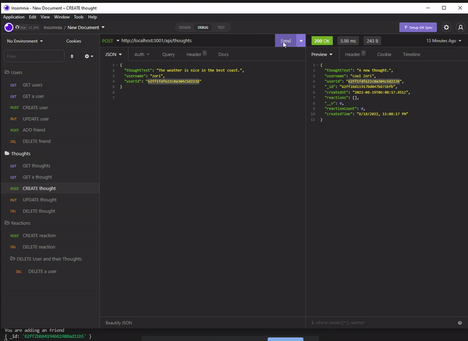

# Simple-Social-Network-API

## Description 

This project aims to showcase my ability in utilizing MongoDB to create an API for a social network web application where users can share their thoughts, react to friends’ thoughts, and create a friend list.




## Usage

In order to do this project, I used Express.js for routing:

`thoughtRoutes.js`
```JavaScript
const router = require("express").Router();
const {
  getThoughts,
  getSingleThought,
  createThought,
  updateThought,
  deleteThought,
  createReaction,
  deleteReaction,
} = require("../../controllers/thoughtController.js");
// /api/thoughts
router.route("/").get(getThoughts).post(createThought);
// /api/thoughts/:thoughtId
router
  .route("/:thoughtId")
  .get(getSingleThought)
  .put(updateThought)
  .delete(deleteThought);
router.route("/:thoughtId/reactions").post(createReaction);
router.route("/:thoughtId/reactions/:reactionId").delete(deleteReaction);
module.exports = router;
```

`thoughtController.js`
```Javascript
const { Thought, User } = require("../models");
module.exports = {
  // Get all thoughts
  getThoughts(req, res) {
    Thought.find()
      .then((thoughts) => res.json(thoughts))
      .catch((err) => res.status(500).json(err));
  },
  // Get a thought
  getSingleThought(req, res) {
    Thought.findOne({ _id: req.params.thoughtId })
      .select("-__v")
      .then((thought) =>
        !thought
          ? res.status(404).json({ message: "No thought with that ID" })
          : res.json(thought)
      )
      .catch((err) => res.status(500).json(err));
  },
```
and a schema for a MongoDB database and the Mongoose ODM:

`Thought.js`
```Javascript
const {Schema, model, Types} = require('mongoose');
const reactionSchema = new Schema({
    reactionId: {
        type: Schema.Types.ObjectId,
        default: () => new Types.ObjectId()
    },
    reactionBody: {
        type: String,
        required: true,
        maxLength: 280
    },
    username: {
        type: String,
        required: true
    },
    createdAt: {
        type: Date,
        default: Date.now,
    }    
},
    {
        toJSON: {virtuals: true},
        id: false
    }
)
reactionSchema.virtual('createdTime').get(function() {
    return this.createdAt.toLocaleString();
});
const thoughtSchema = new Schema({
    thoughtText: {
        type: String,
        required: true,
        minLength: 1,
        maxLength: 280
    },
    createdAt: {
        type: Date,
        default: Date.now

    },
    username: {
        type: String,
        required: true
    },
    userId: {
        type: Schema.Types.ObjectId,
        ref: 'user'
    },
    reactions: [reactionSchema]
    },
    {
    toJSON: {virtuals: true},
    id: false
    }
);
thoughtSchema.virtual('reactionCount').get(function() {
    return this.reactions.length;
});
thoughtSchema.virtual('createdTime').get(function() {
    return this.createdAt.toLocaleString();
});
const Thought = model('thought', thoughtSchema);
module.exports = Thought;
```

## Links

There is no deployed link but demo video available [here](https://www.youtube.com/watch?v=3HlkR5N3mUM).

[Project Repository](https://github.com/zzzorigtbaatar/Simple-Social-Network-API)

## Credits

* Jerome Chenette, UC Berkeley Extension Coding BootCamp

* https://www.npmjs.com/package/mongodb

* https://www.npmjs.com/package/mongoose

## License

[LICENSE](/LICENSE)

## Contact

https://www.linkedin.com/in/zorizulkhuu/

https://github.com/zzzorigtbaatar